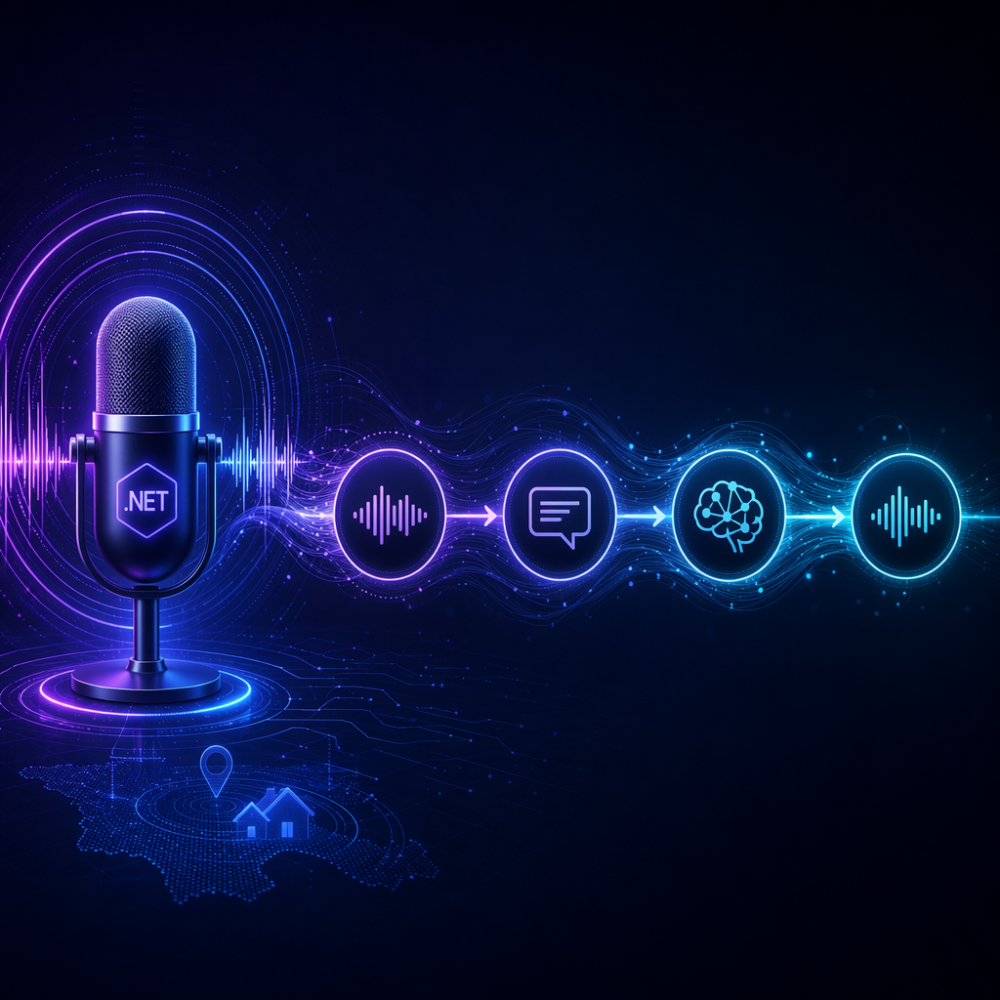

# ElBruno.Speech



[](https://www.nuget.org/packages/ElBruno.Speech.Pipeline)
[](https://www.nuget.org/packages/ElBruno.Speech.Pipeline)
[](https://github.com/elbruno/ElBruno.Speech/actions/workflows/ci.yml)
[](LICENSE)
[](https://dotnet.microsoft.com/)
[](https://github.com/elbruno/ElBruno.Speech)
[](https://twitter.com/elbruno)

## Local-first speech runtime for .NET — VAD → STT → LLM → TTS 🎙️

A reusable, local-first speech runtime for .NET 8 and .NET 10. Built on [Microsoft.Extensions.AI](https://learn.microsoft.com/dotnet/ai/microsoft-extensions-ai) provider boundaries — works with local models (Whisper, VibeVoice, Qwen-TTS, Ollama) and cloud providers (Azure OpenAI, OpenAI) without changing orchestration code.

```text
Audio input
    ↓
Audio normalization · resampling · framing · buffering
    ↓
Voice Activity Detection (Silero VAD)
    ↓
Turn detection · utterance assembly
    ↓
ISpeechToTextClient
    ↓
IChatClient
    ↓
Streaming text segmentation
    ↓
ITextToSpeechClient
    ↓
Audio output
```

## Packages

| Package | NuGet | Downloads | Description |
|---------|-------|-----------|-------------|
| `ElBruno.Speech.Abstractions` | [](https://www.nuget.org/packages/ElBruno.Speech.Abstractions) | [](https://www.nuget.org/packages/ElBruno.Speech.Abstractions) | Audio types, VAD contracts, session interfaces, error types |
| `ElBruno.Speech.Audio` | [](https://www.nuget.org/packages/ElBruno.Speech.Audio) | [](https://www.nuget.org/packages/ElBruno.Speech.Audio) | WAV I/O, PCM conversion, resampling, framing, ring buffers |
| `ElBruno.Speech.Vad.Silero` | [](https://www.nuget.org/packages/ElBruno.Speech.Vad.Silero) | [](https://www.nuget.org/packages/ElBruno.Speech.Vad.Silero) | Silero VAD via ONNX Runtime — streaming voice activity detection |
| `ElBruno.Speech.Pipeline` | [](https://www.nuget.org/packages/ElBruno.Speech.Pipeline) | [](https://www.nuget.org/packages/ElBruno.Speech.Pipeline) | VAD → STT → LLM → TTS orchestration, bounded channels, barge-in |
| `ElBruno.Speech.AspNetCore` | [](https://www.nuget.org/packages/ElBruno.Speech.AspNetCore) | [](https://www.nuget.org/packages/ElBruno.Speech.AspNetCore) | WebSocket endpoint, session registry, health checks |
| `ElBruno.Speech.NAudio` | [](https://www.nuget.org/packages/ElBruno.Speech.NAudio) | [](https://www.nuget.org/packages/ElBruno.Speech.NAudio) | Windows microphone and speaker via NAudio |
| `ElBruno.Speech.OpenTelemetry` | [](https://www.nuget.org/packages/ElBruno.Speech.OpenTelemetry) | [](https://www.nuget.org/packages/ElBruno.Speech.OpenTelemetry) | Activities, metrics, Aspire-compatible instrumentation |
| `ElBruno.Speech.Cli` | [](https://www.nuget.org/packages/ElBruno.Speech.Cli) | [](https://www.nuget.org/packages/ElBruno.Speech.Cli) | `elbrunospeech` dotnet tool |

---

## Installation

```bash
dotnet add package ElBruno.Speech.Pipeline
dotnet add package ElBruno.Speech.Vad.Silero
```

Install the CLI tool globally:

```bash
dotnet tool install -g ElBruno.Speech.Cli
elbrunospeech --help
```

---

## Quick Start

```csharp
// Register providers
services.AddWhisper(o => o.Model = KnownWhisperModels.WhisperBaseEn);
services.AddLocalLLMs(o => o.Model = KnownModels.Phi35MiniInstruct);
services.AddVibeVoiceTTS(o => o.SampleRate = 24_000);
services.AddSileroVad(o => o.MinimumSilenceDuration = TimeSpan.FromMilliseconds(500));

// Build the pipeline
services.AddSpeechPipeline(builder =>
{
    builder
        .UseVoiceActivityDetector<SileroVoiceActivityDetector>()
        .UseSpeechToText(sp => sp.GetRequiredService<ISpeechToTextClient>())
        .UseChatClient(sp => sp.GetRequiredService<IChatClient>())
        .UseTextToSpeech(sp => sp.GetRequiredService<ITextToSpeechClient>())
        .UseSentenceChunking(o =>
        {
            o.MinimumCharacters = 24;
            o.MaximumCharacters = 220;
            o.FlushTimeout = TimeSpan.FromMilliseconds(350);
        })
        .UseBargeIn(o => o.CancelOnSpeechStart = true);
});

// Use it
var pipeline = sp.GetRequiredService<ISpeechPipeline>();
await using var session = await pipeline.CreateSessionAsync();

await session.WriteAudioAsync(frame);
await foreach (var update in session.GetUpdatesAsync())
{
    // SpeechStartedUpdate, FinalTranscriptUpdate, AssistantAudioChunkUpdate, ...
}
```

---

## CLI Tool

```bash
elbrunospeech devices                        # list audio input/output devices
elbrunospeech transcribe recording.wav       # transcribe a WAV file
elbrunospeech vad recording.wav             # run voice activity detection
elbrunospeech talk "Hello world" out.wav    # synthesize text to WAV
```

---

## Observability

```csharp
builder.Services.AddOpenTelemetry()
    .AddSpeechPipelineTelemetry();           // meter: ElBruno.Speech, source: ElBruno.Speech
// Aspire automatically configures OTLP export via OTEL_EXPORTER_OTLP_ENDPOINT
```

---

## Samples

| Sample | Description |
|--------|-------------|
| `FileToSpeech` | WAV file → transcript → answer → WAV output |
| `LocalVoiceAgent` | Microphone → VAD → Whisper → LLM → VibeVoice → speaker (barge-in) |
| `WebSocketVoiceAgent` | ASP.NET Core WebSocket endpoint + browser client |
| `AspireVoiceAgent` | Full Aspire AppHost with tracing, metrics, and dashboard |

---

## Related Repositories

- [ElBruno.Whisper](https://github.com/elbruno/ElBruno.Whisper) — `ISpeechToTextClient` via ONNX Whisper
- [ElBruno.LocalLLMs](https://github.com/elbruno/ElBruno.LocalLLMs) — `IChatClient` for local LLMs
- [ElBruno.VibeVoiceTTS](https://github.com/elbruno/ElBruno.VibeVoiceTTS) — `ITextToSpeechClient` via VibeVoice
- [ElBruno.QwenTTS](https://github.com/elbruno/ElBruno.QwenTTS) — `ITextToSpeechClient` via Qwen3-TTS
- [ElBruno.HuggingFace.Downloader](https://github.com/elbruno/ElBruno.HuggingFace.Downloader) — model downloads

---

## Requirements

- .NET 8.0 or .NET 10.0
- Windows, Linux, or macOS
- NAudio package requires Windows (microphone/speaker I/O)

---

## Building from Source

```bash
git clone https://github.com/elbruno/ElBruno.Speech.git
cd ElBruno.Speech
dotnet restore
dotnet build
dotnet test --filter "Category!=Integration"
```

---

## 📄 License

MIT — see [LICENSE](LICENSE).

---

## 👋 About the Author

Hi! I'm **ElBruno** 🧡, a passionate developer and content creator exploring AI, .NET, and modern development practices.

**Made with ❤️ by [ElBruno](https://github.com/elbruno)**

If you like this project, consider following my work across platforms:

- 📻 **Podcast**: [No Tienen Nombre](https://notienenombre.com) — Spanish-language episodes on AI, development, and tech culture
- 💻 **Blog**: [ElBruno.com](https://elbruno.com) — Deep dives on embeddings, RAG, .NET, and local AI
- 📺 **YouTube**: [youtube.com/elbruno](https://www.youtube.com/elbruno) — Demos, tutorials, and live coding
- 🔗 **LinkedIn**: [@elbruno](https://www.linkedin.com/in/elbruno/) — Professional updates and insights
- 𝕏 **Twitter**: [@elbruno](https://www.x.com/elbruno/) — Quick tips, releases, and tech news

## 🙏 Acknowledgments

- [Microsoft.Extensions.AI](https://learn.microsoft.com/dotnet/ai/microsoft-extensions-ai) — ISpeechToTextClient, IChatClient, ITextToSpeechClient interfaces
- [Silero VAD](https://github.com/snakers4/silero-vad) — voice activity detection model
- [ONNX Runtime](https://github.com/microsoft/onnxruntime) — local model inference
- [NAudio](https://github.com/naudio/NAudio) — Windows audio I/O

