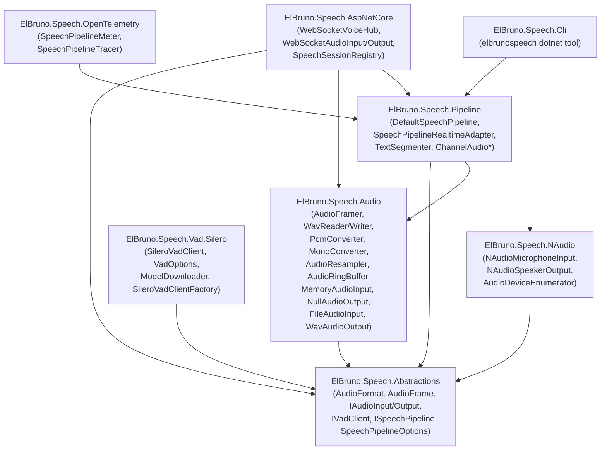

# Architecture

> **ElBruno.Speech** — local-first .NET 8/10 speech runtime orchestrating a **VAD → STT → LLM → TTS** pipeline using `Microsoft.Extensions.AI` provider boundaries.

---

## Package Dependency Graph



### Dependency Rules

| Rule | Rationale |
|------|-----------|
| **No library references `ElBruno.Speech.NAudio`** except `ElBruno.Speech.Cli` | NAudio is Windows/platform-specific |
| **Abstractions has zero external dependencies** | Keeps the public API surface portable |
| **Audio has no knowledge of Pipeline** | Prevents circular dependency |
| **AspNetCore references Audio directly** | `WebSocketAudioInput` uses `AudioFramer` at compile time |

---

## Data Flow

```
IAudioInput
   │  ReadFramesAsync() → AudioFrame (640 bytes, 20ms, 16kHz mono Int16)
   ▼
AudioFramer  ← optional resampling (AudioResampler) and downmix (MonoConverter)
   │  Channel<AudioFrame> (bounded 64, DropOldest)
   ▼
IVadClient.ProcessFrameAsync()  [optional — null = pass-through]
   │  Accumulates speech frames; emits utterance bytes on silence
   │  Channel<byte[]> (bounded 4, Wait)
   ▼
ISpeechToTextClient.GetTextAsync()  [30s timeout, error-isolated]
   │  Returns transcript string
   │  Channel<string> (bounded 4, Wait)
   ▼
IChatClient.GetResponseAsync()  [error-isolated]
   │  Returns LLM response text
   │  Channel<string> (bounded 8, Wait)
   ▼
ITextToSpeechClient.GetAudioAsync()  [error-isolated, barge-in guarded]
   │  Returns PCM bytes (RawRepresentation)
   ▼
IAudioOutput.WriteAsync()  ← AudioFrame
```

---

## DI Composition Patterns

### Minimal (file processing)

```csharp
services.AddSpeechPipeline();
services.AddSingleton<ISpeechToTextClient>(new FakeSpeechToTextClient());
services.AddSingleton<IChatClient>(new FakeChatClient());
services.AddSingleton<ITextToSpeechClient>(new FakeTextToSpeechClient());
```

### Full (ASP.NET Core + WebSocket + VAD)

```csharp
services.AddSpeechPipeline();
services.AddSpeechPipelineAspNetCore();
services.AddSileroVad();
// Register real MEAI providers for STT, LLM, TTS
```

### IRealtimeClient adapter

```csharp
services.AddSpeechPipeline();
services.AddSpeechPipelineRealtimeClient();
// ISpeechPipeline must be registered first (transient)
```

**`DefaultSpeechPipeline` is registered as transient** — each `GetRequiredService<ISpeechPipeline>()` call returns a new instance, giving per-session isolation of generation IDs and internal state.

---

## Bounded Channel Topology

| Channel | Type | Capacity | Full Mode | Rationale |
|---------|------|----------|-----------|-----------|
| Audio | `Channel<AudioFrame>` | 64 (configurable) | `DropOldest` | Real-time audio; old frames are worthless |
| Utterance | `Channel<byte[]>` | 4 | `Wait` | Semantic data; must not lose utterances |
| Transcript | `Channel<string>` | 4 | `Wait` | Semantic data; must not lose transcripts |
| Response | `Channel<string>` | 8 | `Wait` | LLM responses; must not be dropped |

---

## Architecture Principles

From PRD §7:

> - **Local-first**: No cloud services required; all inference runs in-process via ONNX or MEAI providers.
> - **Provider-agnostic**: All AI providers injected via `Microsoft.Extensions.AI` interfaces — swap any provider without changing pipeline code.
> - **Backpressure-by-design**: Bounded channels prevent unbounded memory growth under load.
> - **Error isolation**: Provider failures skip the current utterance; the session continues.
> - **Composable**: Each package is independently usable; consumers take only what they need.
